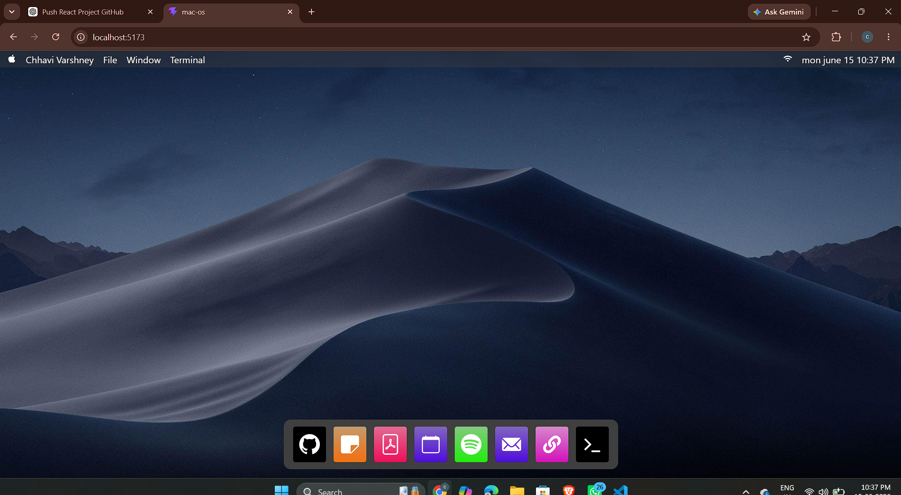

# 🍎 Mac-OS Portfolio

A fully interactive macOS-inspired portfolio built using React.js and Vite. The project recreates the desktop experience of macOS with draggable windows, a functional dock, terminal commands, resume viewer, social links, and GitHub integration.

---

## 🚀 Features

* 🖥️ macOS-inspired User Interface
* 🪟 Draggable & Resizable Windows
* 💻 Interactive Terminal
* 🐙 GitHub Integration
* 📝 Notes Application
* 📄 Resume Viewer
* 📅 Calendar Application
* 🎵 Spotify Integration
* 📧 Contact Information
* 🔗 Social & Portfolio Links
* ⚡ Fast Performance with Vite
* 📱 Responsive Design

---

## 🛠️ Tech Stack

* React.js
* Vite
* SCSS
* React-RND
* JavaScript (ES6+)

---

## 📸 Preview

### Home Screen



---

## 🌐 Live Demo

> Deployment in progress. The live portfolio link will be available soon.

---

## 📂 Installation

Clone the repository:

```bash
git clone https://github.com/chhavi-varshney/mac-os.git
```

Move into the project directory:

```bash
cd mac-os
```

Install dependencies:

```bash
npm install
```

Run the development server:

```bash
npm run dev
```

---

## 💻 Available Terminal Commands

| Command  | Description             |
| -------- | ----------------------- |
| help     | Show available commands |
| about    | About me                |
| projects | View projects           |
| contact  | Contact information     |
| resume   | Open resume             |
| clear    | Clear terminal          |

---

## 📁 Applications

| Application | Description              |
| ----------- | ------------------------ |
| GitHub      | Open GitHub Profile      |
| Notes       | Personal Notes           |
| Resume      | View Resume              |
| Calendar    | Calendar Application     |
| Spotify     | Music Access             |
| Mail        | Contact Information      |
| Links       | Social Links             |
| Terminal    | Interactive Command Line |

---

## 🚀 Future Enhancements

* Window Minimize & Maximize
* Browser Application
* File Explorer
* Theme Customization
* Mobile Optimization
* More Terminal Commands

---

## 👨‍💻 Developer

**Chhavi Varshney**

* GitHub: https://github.com/chhavi-varshney
* LinkedIn: https://www.linkedin.com/in/chhavivarshney/
* Portfolio: Coming Soon

---

## ⭐ Show Your Support

If you like this project, give it a ⭐ on GitHub.

---


